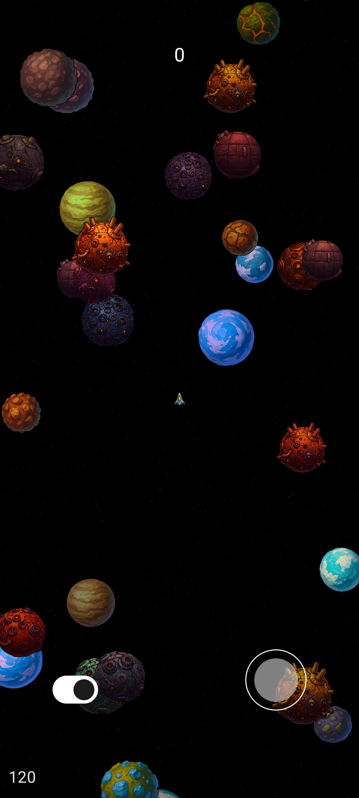
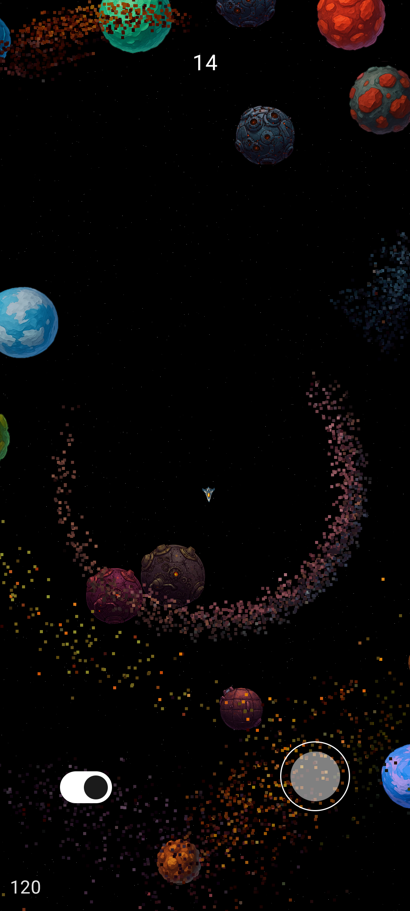
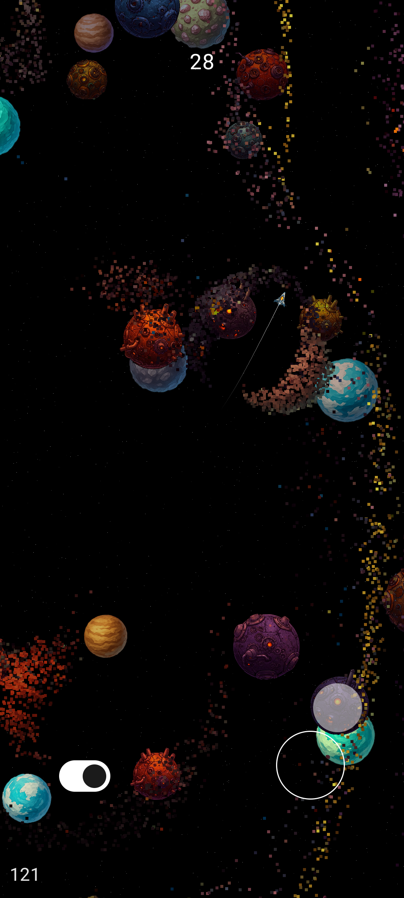
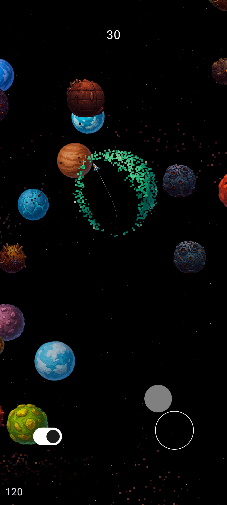
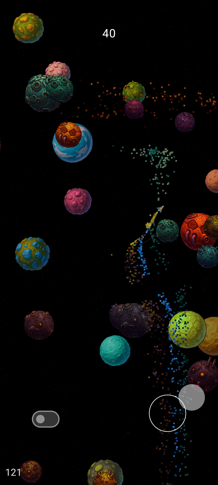
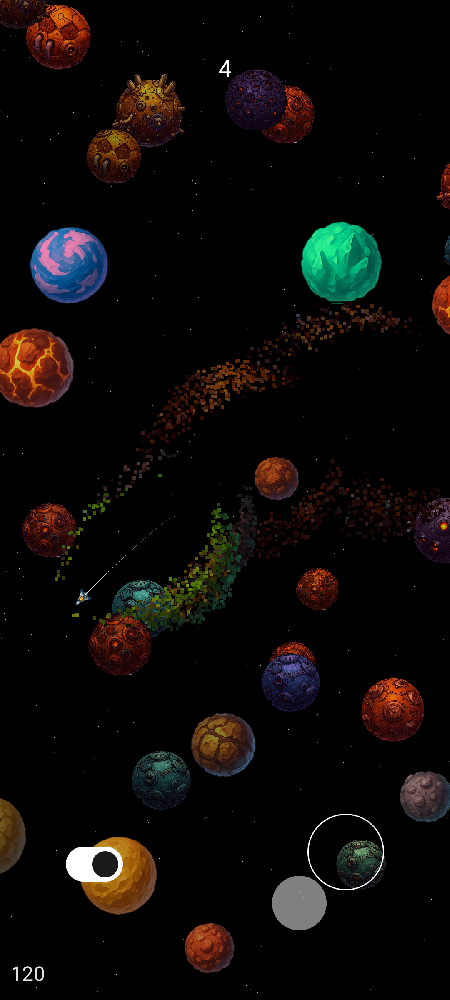
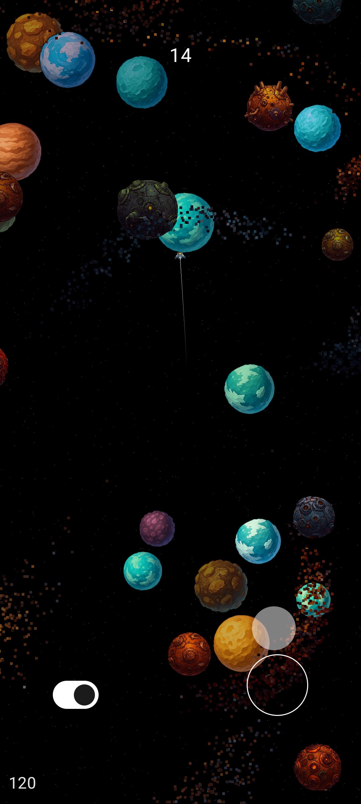
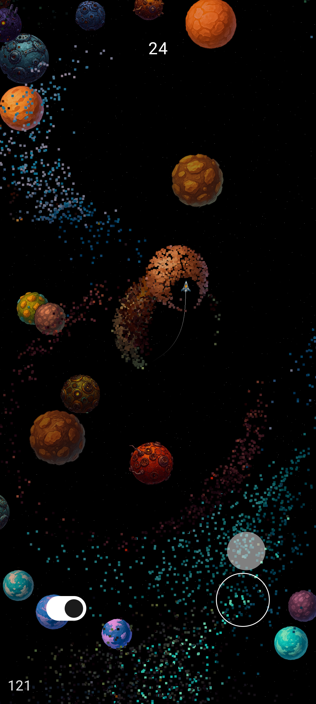

# 🎮 2D Android Game: An Exploration of OpenGL and Jetpack Compose

This project represents my personal journey in developing a 2D game for Android, driven by a curiosity to integrate the low-level control of OpenGL ES with the modern UI paradigms offered by Jetpack Compose.
It's an ongoing effort to create a performant and maintainable application while adhering to a clean architectural style.

  
  
  
  
  
  
  
  

## Key Aspects

*   **🤖 Native Android Implementation:** Developed in Kotlin, aiming for optimal integration with the Android platform and efficient execution.
*   **🔆 OpenGL ES for Rendering:** Employs OpenGL ES (version 3.1 or higher) as the rendering engine, providing a hands-on exploration of low-level graphics programming.
*   **🧩 Jetpack Compose for User Interface:** Integrates Jetpack Compose for crafting the user interface.
*   **🏗️ Clean Architecture Principles:** Attempts to follow clean architecture principles, separating the core engine, game logic, and UI concerns into distinct modules.
*   **⚡ GPU-Accelerated Techniques:** Explores the use of compute shaders for tasks like collision detection, hoping to leverage the GPU's parallelism for performance gains.
*   **🚀 Performance Considerations:** Includes ongoing efforts to optimize the game's performance, striving for a smooth experience on a range of Android devices.

## Project Structure

The project is organized into modules, reflecting an attempt to apply clean architecture:

*   **`🛠️ engine` Module:** Contains the core OpenGL ES rendering components:
    *   Shader management and compilation.
    *   Buffer and vertex data handling.
    *   Basic drawing functions for game elements.
    *   Compute shader implementations for specific tasks.
    *   Camera and projection setup (which may not be fully refined yet).
*   **`🎲 game` Module:** Implements the game's logic and entities:
    *   Manages the overall game state and lifecycle.
    *   Defines game object classes (player, obstacles, etc.) and their behaviors.
    *   Handles user input and translates it into game actions.
    *   Integrates with the engine's collision detection.
*   **`💫 ui` Module:** Constructs the user interface using Jetpack Compose:
    *   Defines composable functions for different screens and UI elements.
    *   Handles user interactions and communicates with the game logic.
    *   Integrates the `GLSurfaceView` for rendering the OpenGL scene within the Compose UI.

---

> 🚧 **Project Status:** Under active development! 🚧